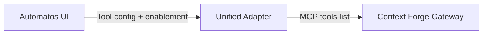
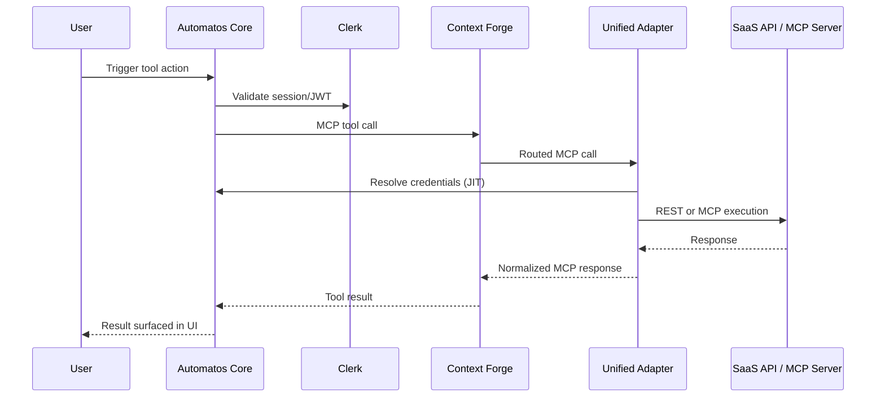
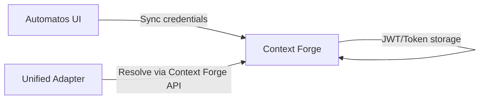

 # Unified Adapter Architecture
 
## Components

- **Automatos UI**: Admin UX for tool + credential CRUD (system of record).
- **Clerk**: Identity provider for SaaS auth, orgs/tenants, session JWTs.
- **Context Forge Gateway**: Public MCP gateway, tool discovery + routing.
- **Unified Adapter**: Single MCP server exposing many tools.
- **Automatos API Client**: Pulls tool definitions and resolves credentials.
- **Tool Registry**: Builds MCP tool definitions for discovery.
- **OpenAPI Loader**: Loads and parses OpenAPI specs for REST passthrough.
- **Executors**:
  - REST executor (OpenAPI-based).
  - MCP executor (proxy to upstream MCP servers).

## Functional Responsibility Table

| Component | Primary Function | Notes |
|---|---|---|
| Automatos UI | Tool + credential management UX | Client UI; tool metadata lives in adapter. |
| Clerk | User/org auth + JWT issuance | Provides tenant/org claims for SaaS auth. |
| Context Forge Gateway | Single external MCP endpoint | Discovers tools from adapter; routes tool calls. |
| Unified Adapter | Single MCP server for many tools | Stateless execution layer + Postgres tool registry. |
| Automatos API | Credential vault (optional) | Used when Automatos hosts stored credentials (hosted mode). |

## High-Level Discovery Flow

 
## Request Flow (Execution)

## Credential Flow (Current)

- **Hosted mode**: Automatos UI stores encrypted credentials in Automatos; adapter resolves via `/api/credentials/resolve`.
- **BYO mode**: Client supplies credentials per call; adapter never stores them.
- Credentials are used in-memory for a single request and never logged.

## Credential Flow (If Context Forge Owns Credentials)

## Tool Discovery Refresh

- Current behavior: tools are loaded at startup and cached (restart required).
- Planned improvement: periodic refresh or webhook invalidation to avoid restarts.
 
## Security

- Automatos API access uses a service API key (internal).
- Clerk provides user/org JWTs for SaaS auth.
- Optional adapter auth token enforced on inbound MCP requests.
- Credential values are never logged.
 
 ## Scaling Considerations
 
 - Max concurrency limit to protect upstream APIs.
 - Tool allowlists keep tool counts within model limits.
 - OpenAPI caching to reduce external fetch overhead.
